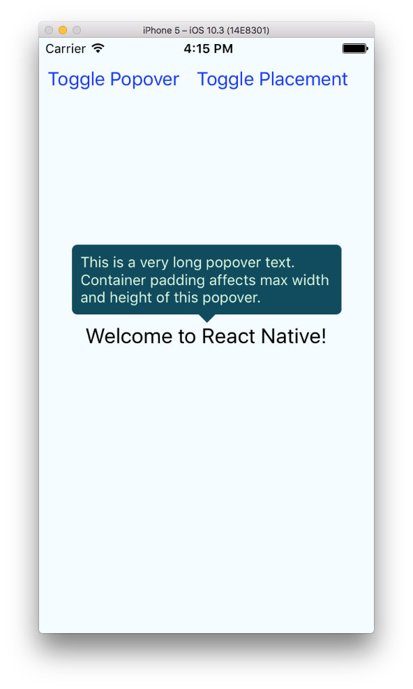

# react-native-simple-popover

[](https://www.npmjs.com/package/react-native-simple-popover)
[](https://www.npmjs.com/package/react-native-simple-popover)

`react-native-simple-popover` provides a simple popover implementation and supports automatic popover placement.

## Installation

```
$ npm install react-native-simple-popover
```

This package does not provide native modules and does not require linking and rebuilding your application.

## API

### `<PopoverContainer padding>`

Provides ability for child `Popover` components to register and render inside this element. Child popovers are constrained
by this component and render above the children.

#### Props

* `padding` (*Number*): Pads component area to constrain your popovers.
* `children` (*ReactElements*): Component tree that you want your popovers to render in.

### `<Popover component isVisible arrowColor arrowWidth arrowHeight placement>`

Renders component with defined properties around the wrapped component.

#### Props

* `component` (*Component*): Popover component to render.
* `isVisible` (*Boolean*): Defines if popover is visible. Defaults to `true`.
* `arrowColor` (*Color*): Popover's arrow color. Defaults to `white`.
* `arrowWidth` (*Number*): Popover's arrow width. Defaults to `15`.
* `arrowHeight` (*Number*): Popover's arrow height. Defaults to `10`.
* `placement` (*'left' || 'right' || 'top' || 'bottom' || 'auto'*):
  Where popover should be placed related to the wrapped component. if `'auto'`,
  all placement options are tried and first suitable placement option is picked.
  Defaults to `'auto'`.
* `children` (*ReactElement*): Component that you want your popover to point to.

## Example

Please check [Example](./Example) directory for an example project with the following implementation:

```js
import React, { Component } from 'react';
import {
  AppRegistry,
  Button,
  StyleSheet,
  Text,
  TextInput,
  View
} from 'react-native';
import { Popover, PopoverContainer } from 'react-native-simple-popover';

class Example extends Component {

  state = {
    isPopoverVisible: true,
    popoverPlacement: 'top',
  };

  render() {
    return (
      <PopoverContainer padding={20}>
        <View style={styles.container}>
          <Popover
            placement={this.state.popoverPlacement}
            arrowColor="#114B5F"
            arrowWidth={16}
            arrowHeight={8}
            isVisible={this.state.isPopoverVisible}
            component={() => (
              <View style={styles.popoverContainer}>
                <Text style={styles.popoverText}>
                  This is a very long popover text.
                  Container padding affects max width and height of this popover.
                </Text>
              </View>
            )}
          >
            <Text style={styles.welcome}>
              Welcome to React Native!
            </Text>
          </Popover>
          <View style={styles.buttons}>
            <Button
              title="Toggle Popover"
              onPress={() => {
                this.setState({ isPopoverVisible: !this.state.isPopoverVisible });
              }}
            />
            <Button
              title="Toggle Placement"
              onPress={() => {
                this.setState({
                  popoverPlacement: this.state.popoverPlacement === 'top' ? 'bottom': 'top'
                });
              }}
            />
          </View>
        </View>
      </PopoverContainer>
    );
  }
}

const styles = StyleSheet.create({
  container: {
    flex: 1,
    justifyContent: 'center',
    alignItems: 'center',
    backgroundColor: '#F5FCFF',
  },
  welcome: {
    fontSize: 20,
    textAlign: 'center',
    margin: 10,
  },
  buttons: {
    position: 'absolute',
    flexDirection: 'row',
    flex: 1,
    top: 0,
    left: 0,
    marginTop: 20,
  },
  popoverContainer: {
    backgroundColor: '#114B5F',
    padding: 8,
    borderRadius: 5,
  },
  popoverText: {
    color: '#E4FDE1',
  }
});

AppRegistry.registerComponent('Example', () => Example);
```


